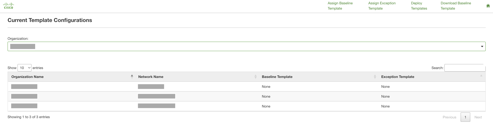
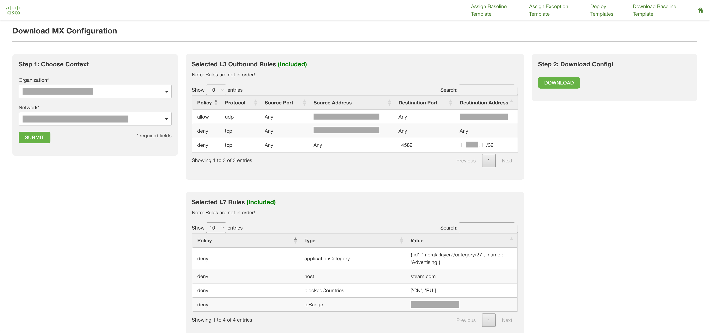
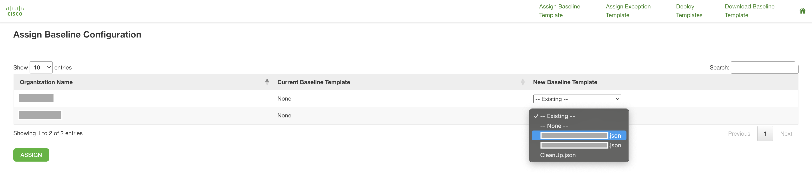
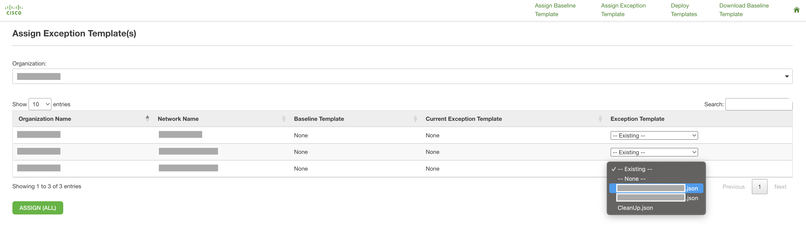
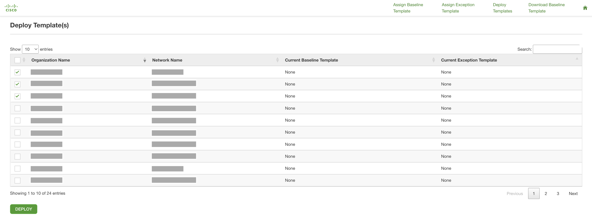

# Meraki MX Security Baseline Templates

This flask app provides the ability to provision Meraki MXs with a set of security configurations ("security templates") regardless of network or **organization**. This app addresses the limitation of native Meraki Templates which only exist within a single organization. 2 types of security templates are supported: 
* Baseline Templates: Set at the organization Level (applies to all networks within an organization)
* Exception Templates: Set per network

The supported security configurations are:
* L3 Outbound Rules ([API](https://developer.cisco.com/meraki/api/update-network-appliance-firewall-l-3-firewall-rules/))
* L7 Rules ([API](https://developer.cisco.com/meraki/api/update-network-appliance-firewall-l-7-firewall-rules/))
* Content Filtering Rules (URL, Category) ([API](https://developer.cisco.com/meraki/api/update-network-appliance-content-filtering/))

Templates are combined via `Baseline Template + Exception Template`. The combined order of L3, L7, and Content Rules is determined following this equation (order is maintained within the templates).

When deploying a template to a network, existing security configurations will be **overwritten**.

**Note**:
* For L3 Outbound Rules, it's expected all required network configuration (local VLANs, static routes, etc.) will be in place when applying rules with a Source IP or CIDR. If the configuration is missing, the same errors encountered on the dashboard will be encountered with the API. Policy Objects/Groups are **not** supported at this time.

## Contacts
* Trevor Maco

## Solution Components
* Meraki MX

## Prerequisites
#### Meraki API Keys
In order to use the Meraki API, you need to enable the API for your organization first. After enabling API access, you can generate an API key. Follow these instructions to enable API access and generate an API key:
1. Login to the Meraki dashboard
2. In the left-hand menu, navigate to `Organization > Settings > Dashboard API access`
3. Click on `Enable access to the Cisco Meraki Dashboard API`
4. Go to `My Profile > API access`
5. Under API access, click on `Generate API key`
6. Save the API key in a safe place. The API key will only be shown once for security purposes, so it is very important to take note of the key then. In case you lose the key, then you have to revoke the key and a generate a new key. Moreover, there is a limit of only two API keys per profile.

> For more information on how to generate an API key, please click [here](https://developer.cisco.com/meraki/api-v1/#!authorization/authorization). 

> Note: You can add your account as Full Organization Admin to your organizations by following the instructions [here](https://documentation.meraki.com/General_Administration/Managing_Dashboard_Access/Managing_Dashboard_Administrators_and_Permissions).

#### Docker
This app provides a `Docker` file for easy deployment. `Docker` is the recommended deployment method. Install `Docker` [here](https://docs.docker.com/get-docker/).

## Installation/Configuration
1. Clone this repository with `git clone [repository name]`. To find the repository name, click the green `Code` button above the repository files. Then, the dropdown menu will show the https domain name. Click the copy button to the right of the domain name to get the value to replace [repository name] placeholder.
2. Rename the `.env_sample` file to `.env`. Rename `config_sample.py` to `config.py` (located at: `flask_app/config_sample.py`)
3. Add Meraki API key to environment variable in `.env`:
```dotenv
# Meraki Section
MERAKI_API_KEY=""
```
4. This app provides the ability to control which security configurations to consider when building and synchronizing templates (all supported configurations are tracked by default). To ignore a security configuration, modify the dictionary value to `False` in `config.py`.
When set to `False`, any existing configuration (in the dashboard) is maintained and any respective configuration included within the template files is ignored.
```python
tracked_settings = {
    "mx_l3_outbound_firewall": True,
    "mx_l7_firewall": True,
    "mx_content_rules": True
}
```
5. Set up a Python virtual environment. Make sure Python 3 is installed in your environment, and if not, you may download Python [here](https://www.python.org/downloads/). Once Python 3 is installed in your environment, you can activate the virtual environment with the instructions found [here](https://docs.python.org/3/tutorial/venv.html).
6. Install the requirements with `pip3 install -r requirements.txt`

## Usage
To run the program (from the top-level directory), use the following commands to run with python directly:
```
$ python3 flask_app/db.py
$ python3 flask_app/app.py
```
or with the docker command:
```
$ docker-compose up -d --build
```

**Note**:
* `db.py` creates a sqlite database which maintains the template mappings (**it must be run first!**) while `app.py` represents the main flask app.
* App logs and output are written to stdout console and log files in `flask_app/logs`

Once the app is running, navigate to http://127.0.0.1:5000 to be greeted with the main landing page (overview page):



To see currently assigned baseline and exception templates, select an organization and search the table.

The remaining pages and workflows are summarized below. The order in which the pages are shown shows a possible workflow when deploying your first security templates.

`Download Templates`:



* Downloads the security config from an existing MX network to a JSON file (`[network-name].json`) in `flask_app/mx_configs`. Once downloaded, the security config can be used as a baseline or exception template. The template is organized into named sections (ex: `mx_l3_outbound_firewall`) and respective payloads which follow the Meraki API. It's possible to modify/create the JSON files directly, but each section's name and payload must be in the proper format (based on the Meraki API call documentation). See `blank_example.json` for the skeleton format.

`Assign Baseline`:



* Assign baseline template to an organization (available options are within `flask_app/mx_configs`)

`Assign Exception`:



* Assign exception template to a network (available options are within `flask_app/mx_configs`)

`Deploy Tempaltes`



* Deploy baseline and exception templates to each selected network. Templates will be combined and deployed to each network, with each security setting deploying individually. If a setting fails to deploy (invalid format, invalid rules, etc.), that particular setting with fail with an error message displayed to the screen but will not impact other security settings.


Optional: A cronjob can be created to periodically synchronize the networks and organizations with their assigned templates based on the sqlite database (`periodic_enforcement.py`). Please consult `crontab.txt` for more information.


### LICENSE

Provided under Cisco Sample Code License, for details see [LICENSE](LICENSE.md)

### CODE_OF_CONDUCT

Our code of conduct is available [here](CODE_OF_CONDUCT.md)

### CONTRIBUTING

See our contributing guidelines [here](CONTRIBUTING.md)

#### DISCLAIMER:
<b>Please note:</b> This script is meant for demo purposes only. All tools/ scripts in this repo are released for use "AS IS" without any warranties of any kind, including, but not limited to their installation, use, or performance. Any use of these scripts and tools is at your own risk. There is no guarantee that they have been through thorough testing in a comparable environment and we are not responsible for any damage or data loss incurred with their use.
You are responsible for reviewing and testing any scripts you run thoroughly before use in any non-testing environment.